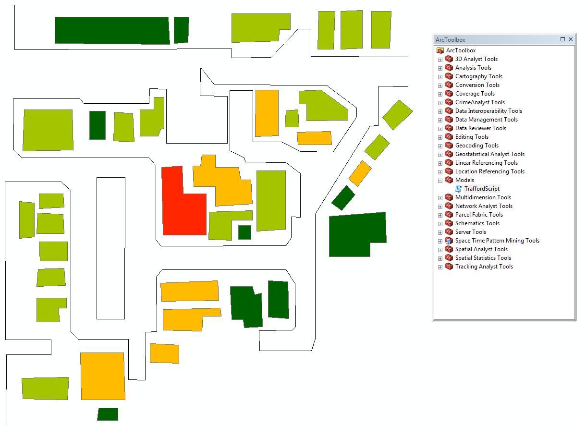

These projects have been developped as part of the module *Programming for Geographical Information Analysts: Advanced Skills* from the University of Leeds (2017-2018).

## [Mapping places mentionned in a poem - an application of Natural Language Processing](https://github.com/mednche/AdvancedProgrammingSkills/tree/master/NLP)

  

The aim of this project was to familiarise myself with Natural Language Processing through the application of Part of Speech tagging. The project also involves automatic querrying of the Google API as well as the use of Bokeh interractive maps to visualise the results. More information can be found in the Github repository (see title link).

## [Mapping the risk of burglary - a Python addin for ArcGIS](https://github.com/mednche/AdvancedProgrammingSkills/tree/master/AddinArcGIS)

Manchester police, based on work by a variety of people, have found that in general, if somewhere is burgled, there is an increased risk of burglary for the houses within 400m of the burgled house for up to 4 weeks. This is known as the Trafford Model.

This addin buffers a burglary file and then list the houses in an area by chance of burglary. Those houses that fall inside the most buffers will have the largest burglary risk. As our area is a rather small corner of the East End of London, we've used 80m buffers.

This addin displays the houses with the highest risk as a choropleth map, coloured by risk, and an associated sorted table.

  

[<- Homepage](https://mednche.github.io)
